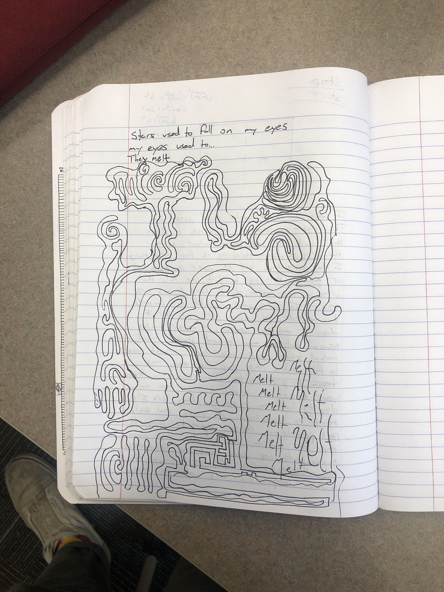

V1 has both devolved and evolved from V0:
- Devolved in the sense that it's now just a static site, and not a cms or anything fancy
- Evolved in the sense that it's now a static site, and not a cms or anything fancy

Making it static has made it alot easier to decentralize it, which was my main goal.
Relying on external tools (likeusing external services for deplying to ipfs, content management) has made the project easier to maintain and develop.
Scaling down the ambition of the project's versioning feature sets and CMS features has made it easier to focus on why I wanted to build this in the first place: to have a place to write.

The thing you're reading is just a simple markdown file hosted on IPFS through a service called
[fleek](https://fleek.xyz/). I'm rendering it with a simple WASM markdown renderer in Rust.
It's deployed by integrating Fleek with my Github, allowing me to manage my content in a basic but easy way.
And because everything is pointed at by a root CID on fleek, I can update and link to content that's hosted with the same root CID. Here's something I drew once:

Of course, I don't think I'm done developing features. For example at the time of writing I want to figure out:
- getting links to posts working with my SPA + an IPFS gateway
- history traversal, so you can walk back through the site's history
- more rendering strategies and more type-safe code for same
- larger file set pinning and publishing with ipfs -- right now everything has to be hosted on Github, which is not ideal

If you have ideas for this project let me know, also feel free to steal it and make it your own.
Maintenance for this project has moved [to this repository](https://github.com/amiller68/krondor-rs).

Hope you like it have fun check back soon

-Alex

