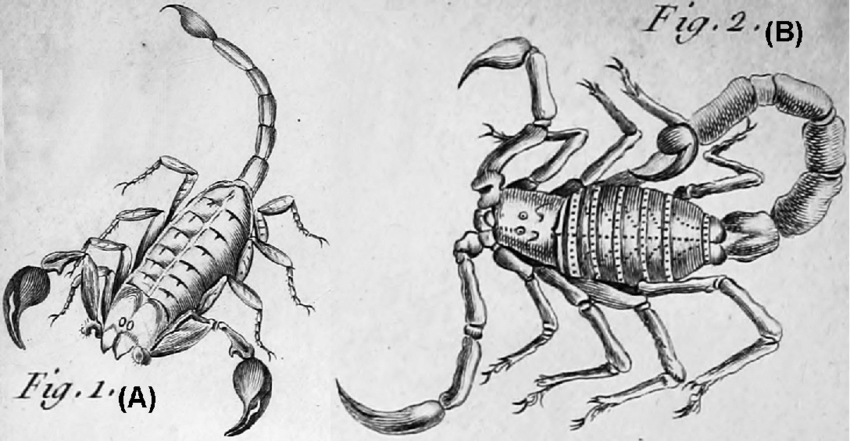

take all the good things you accomplished over the past

12 months

build on them so that the coming year is even better. you

will

never 

reach a time or place in life where you can relax and say "i've done enough"

-- it's simply not in your nature

