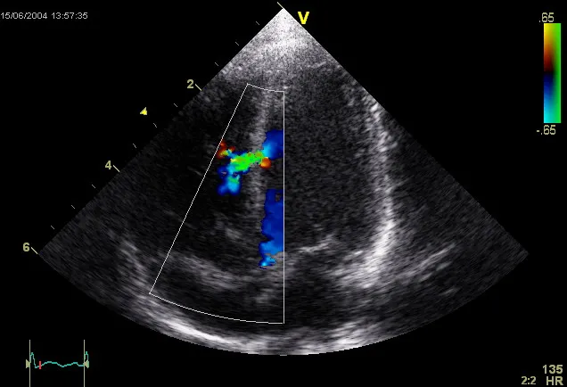

g\*d is a dweed

-- for compliant engineering miracles

ventricles veins arteries aortas valve and little fibery bits that go 

click

click

click

ticking humming and pumping

60 to 70 times per minutes per second per day hour year

slowly breaking

